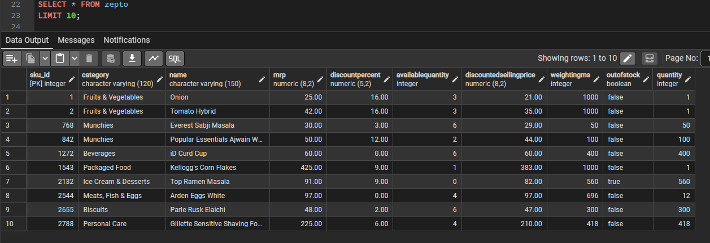
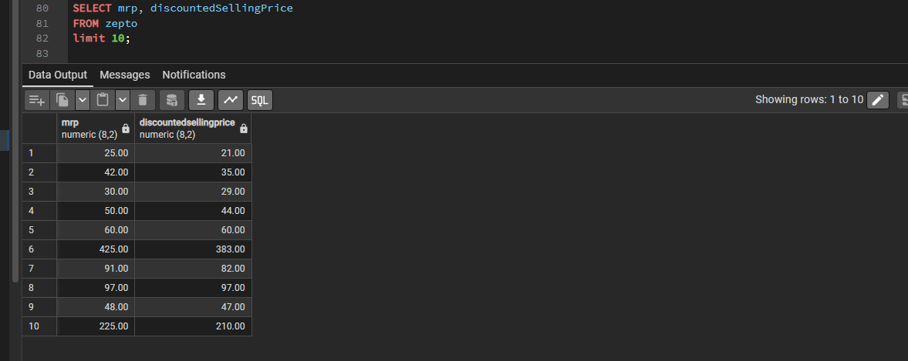
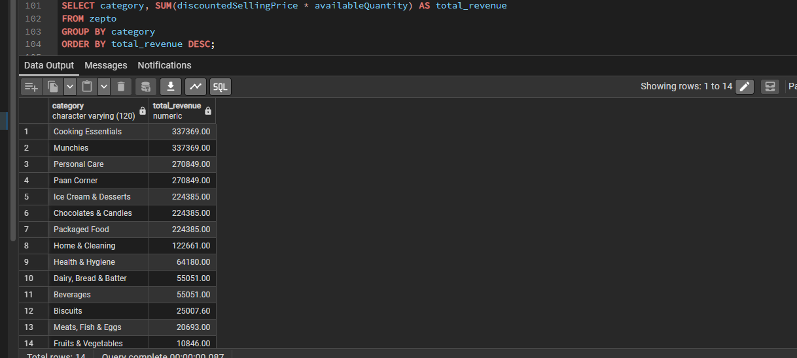
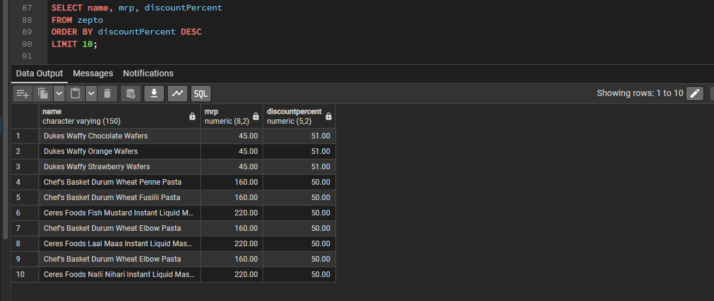

# 🛒 Zepto Inventory Analysis | PostgreSQL


---

# 📌 Project Overview

This project demonstrates an end-to-end SQL data analysis workflow using **PostgreSQL** on Zepto grocery inventory data.

The project focuses on data exploration, cleaning, transformation, and business analysis using SQL to uncover insights related to pricing, discounts, inventory availability, and product categories.

---

# 📸 SQL Analysis Preview

## Database Preview



---

## Data Cleaning



---

## Category Revenue Analysis



---

## Top Discounted Products



---

# 🎯 Business Problem

Retail inventory databases contain thousands of products spread across multiple categories.

Businesses need SQL-based analysis to answer questions such as:

- Which products provide the highest discounts?
- Which categories generate the highest inventory value?
- Which products are currently out of stock?
- Which products provide the best value for money?
- Which categories carry the highest inventory weight?

---

# 📂 Dataset Overview

| Property | Details |
|----------|----------|
| Dataset | Zepto Grocery Inventory |
| Database | PostgreSQL |
| Records | Product Inventory |

### Dataset Includes

- SKU ID
- Product Name
- Category
- MRP
- Discounted Selling Price
- Discount Percentage
- Available Quantity
- Product Weight
- Inventory Status

---

# 🛠️ Technologies Used

- PostgreSQL
- SQL
- pgAdmin
- CSV Import

---

# 🧹 Data Cleaning

The following preprocessing steps were completed before analysis:

- Removed invalid records where MRP was zero.
- Converted prices from paise to rupees.
- Checked for missing values.
- Verified product categories.
- Identified duplicate product names.

---

# 📈 SQL Analysis Performed

- Data Exploration
- Missing Value Detection
- Duplicate Product Analysis
- Inventory Status Analysis
- Data Cleaning
- Revenue Estimation
- Discount Analysis
- Product Ranking
- Category Analysis
- Price per Gram Calculation
- Inventory Weight Analysis
- Product Classification using CASE statements

---

# 📋 Business Questions Answered

- Top 10 products with the highest discounts.
- High-priced products currently out of stock.
- Estimated revenue by product category.
- Premium products with low discounts.
- Categories with the highest average discounts.
- Best value products based on price per gram.
- Product classification based on weight.
- Total inventory weight by category.

---

# 💡 Key Business Insights

- Fruits & Vegetables and Grocery categories contribute significantly to inventory value.
- Several premium products remain out of stock despite high demand.
- Certain categories consistently offer larger discounts.
- Price-per-gram analysis highlights better-value products.
- Inventory weight varies considerably across categories.

---

# 💼 Skills Demonstrated

- PostgreSQL
- SQL
- Data Cleaning
- Exploratory Data Analysis
- Aggregate Functions
- CASE Statements
- GROUP BY
- HAVING
- UPDATE
- DELETE
- Business Analysis

---

# 📁 Repository Structure

```text
Zepto-Inventory-Analysis-PostgreSQL
│
├── Dataset
│   └── Zepto_Inventory_Dataset.csv
│
├── SQL
│   └── Zepto_Inventory_Analysis.sql
│
├── Images
│   ├── Database_Preview.png
│   ├── Data_Cleaning.png
│   ├── Category_Revenue_Analysis.png
│   └── Top_Discounted_Products.png
│
├── README.md
└── LICENSE
```

---

# 🚀 Future Improvements

- Window Function Analysis
- Common Table Expressions (CTEs)
- Stored Procedures
- Index Optimization
- SQL Views
- Sales Trend Analysis

---

# 💼 Resume Project Summary

Developed an end-to-end PostgreSQL project analyzing Zepto grocery inventory data. Performed SQL-based data cleaning, exploratory data analysis, aggregation, and business analysis to identify pricing trends, inventory insights, discount opportunities, and category-level performance using PostgreSQL.

---

# 👨‍💻 Author

## Hanumantha B

**Data Analyst | SQL | PostgreSQL | Python | Power BI | Excel**

### GitHub

https://github.com/hanumanth112

### LinkedIn

https://www.linkedin.com/in/hanumantha-b-673938374

---

## ⭐ If you found this project useful, consider giving it a Star on GitHub!
